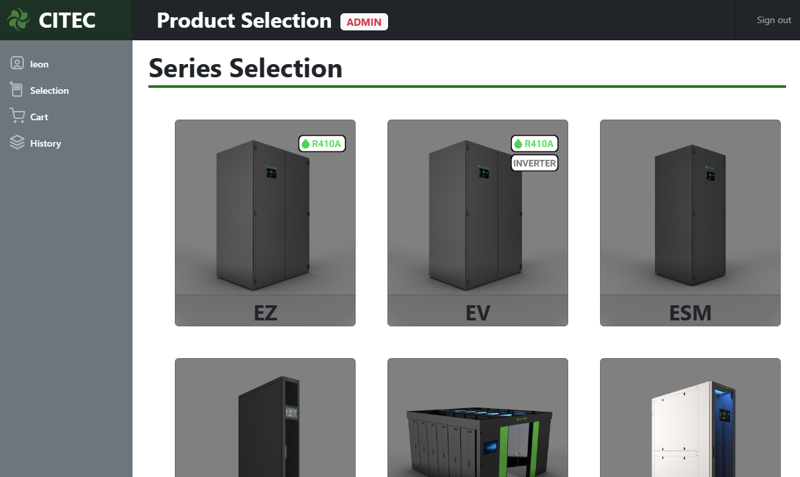

# Product Selection 



Product Selection is a web-based precision cooling air conditioning product selection software. User can select from any available series and model to performance cooling load calculation and generate reports for project tendering. The cooling capacity calculation is within ±5% accuracy.


## Restore Postgresql Database
Create and restore the database ```2024-01-08_model_db.sql```.
After that, update the postgresql database information in the ```setting.py``` file in ```selection\selection``` directory.
```
else:
    DATABASES = {
        'default': {
            'ENGINE': 'django.db.backends.postgresql',
            'NAME': 'your-db-name',
            'USER': 'your-username',
            'PASSWORD': 'your-password',
            'PORT':'your-db-port'
        }
    }
```

## Start Local Hosting
1. In the command prompt terminal, enable local virtual environment
   ```
   C:\Selection New> cd selection
   C:\Selection New\selection> venv\Scripts\activate
   ```


2. Install required libraries if have not.
   ```
   (venv) C:\Selection New\selection> py -m pip install -r requirements.txt
   ```


3. Create super user. <sub>*Email address is optional</sub>
   ```
   (venv) C:\Selection New\selection>py manage.py createsuperuser
   Username (leave blank to use 'ngso'):
   Email address:
   Password:
   Password (again):
   ```

  
4. Local hosting
   ```
   (venv) C:\Selection New\selection>py manage.py runserver
   ```
   By default, the server runs on port 8000 on the IP address 127.0.0.1. You can pass in an IP address and port number explicitly.
   ```
   (venv) C:\Selection New\selection>py manage.py runserver 192.168.0.32:8000
   ```
   If successful the following with show the following:
   ```
   System check identified 0 issue (0 silenced).
   January 11, 2024 - 17:25:07
   Django version 4.1.5, using settings 'selection.settings'
   Starting development server at http://192.168.0.32:8000/
   Quit the server with CTRL-BREAK.
   ```
   Hold control and click on the ```http://192.168.0.32:8000/``` or browse the ip address using a web browser to start using the website.

    
5. Login using superuser credential created in previous step then you are free to select and product performance and generate reports of them.
   
   
   


   
